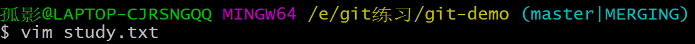

# Git学习（笔记由b站，尚硅谷视频提供，小弟我只是原封不动的敲击了部分）

我真的是服了，这明明是大一下老师规定要学习的，自己不重视，今天摸索了一整天也没有成功把IDEA上的代码push到GitHub中，所了，还是好好学习一下吧。虽然说也不能说不全是我的原因，但是就是自己的原因。

以前欠下了，终究是要还的。

## 1.Git 分布式版本控制工具

免费的，开源的分布式版本控制系统

Git is a [free and open source](https://git-scm.com/about/free-and-open-source) **distributed version control system** designed to handle everything from small to very large projects with speed and efficiency.

Git is [easy to learn](https://git-scm.com/doc) and has a [tiny footprint with lightning fast performance](https://git-scm.com/about/small-and-fast). It outclasses SCM tools like Subversion, CVS, Perforce, and ClearCase with features like [cheap local branching](https://git-scm.com/about/branching-and-merging), convenient [staging areas](https://git-scm.com/about/staging-area), and [multiple workflows](https://git-scm.com/about/distributed).【outclass 远胜于】

### 1.1版本控制

版本控制是一种记录文件内容的变化，以便将来查阅特定版本修订情况的系统。

版本控制其实最重要的是可以记录文件修改记录，从来可以查看历史版本，方便版本切换。

就是在原来的基础上再修改再保存

### 1.2为什么要版本控制

**需要从个人到团队的同步**

### 1.3版本控制工具

#### 1.3.1集中式版本控制工具

SVN CVS

#### 1.3.2分布式版本控制工具

Git

客户端提取的不说最新版本的文件快照，而是把代码仓库完整地镜像下来（本地库）。

- 版本控制是在本地进行的
- 每个客户端都是从远程客户端保存的完整的项目（包含历史纪录）

## 2.Git概述

### 2.1Git历史

Linux系统

### 2.1 Git工作机理

### 2.3 Git与代码托管中心

​		代码托管中心是基于网络服务器的远程代码仓库，一般我们简单的称为**远程库**。

  - 局域网

    GitLab

- 互联网

  GitHub

  Gitee

### 2.4Git安装

略

## 3.Git常用命令

### 3.1设置用户签名

- 基本语法

  $ git config --global user.name 用户名

  $ git config --global user.email 邮箱
  
  $cat ~/.gitconfig
  
- 说明

  签名的作用是区分不同操作者身份。用户的签名信息在每一个版本的提交信息中可以看到，以便确定本次提交是谁做的。【git首次安装一定要设置用户签名，否则无法提交代码。

- 注意

  这里的用户签名和将来登录GitHub（或其他代码托管中心）的账号是没有联系的。

### 3.2初始化本地库

- 基本语法

  **git init**

  

- 查看的方法

  

  **起初我们是看不到的，无论是在Linux操作指令下还是window视窗下，这是因为这个文件夹默认是被隐藏的**

  想要查看的具体方法

  - window视窗下

    

  - Linux窗口

    

    *其实我也不是很懂Linux，所以这个显示我也不是很理解*

- 创建后的状态

  - Linux下

     

  *也可以现在window视窗中进入.git文件夹，再右键单击git blsh here

  window下的文件
  
  ​		
  
  *注意这里的空文件夹不能轻易删除，否则就会出错*
  
  git status
  
  on branch master(主)
  
  no commits yet
  
  新增文件
  
  git add 文件名
  
  git rm --cached 文件名【原本文件是没有删除的，只是删除的暂存区的文件】
  
  提交本地库
  
  git commit -m "描述文字" 文件名

### 3.3查看本地库状态

#### 3.3.1首次查看

- 基本语法

  **git status**

#### 3.3.2新增文件

- 基本语法

  **vim 文件名.后缀名**    *注意文件名用英文*

  

  忘记截图了，简单描述一下吧

  1. $ vim study.txt    点击回车，跳转到一个新的界面
  2. 点击insert按键，进行编辑（否则无法编辑）
  3. 点击Esc按键，退出编辑（yy是复制，p是粘贴）
  4. 输入: wq保存  自动返回上一个界面

#### 3.3.3再次查看

- 查看文件

  

- 查看文件内容

  - 基本语法

    cat 文件名.后缀名

    

    查看文件末尾的最后一行命令 $ tail -n 文件名.后缀名

- 再次查看本地库的状态

  

### 3.4增添到缓存区

#### 3.4.1将工作区的文件添加到暂存区

- 基本语法

  **$ git add 文件名.后缀名**

  

  warning不用管

#### 3.4.2查看状态

#### 

此时是可以删除的，但是值得注意这里的删除是指**删除缓存区里面的文件，但是你的工作区的文件仍然还在的**

window下

上述的操作都是都是工作区与暂存区的，不涉及本地库

### 3.5提交到本地库

#### 3.5.1将暂存区的文件添加到本地库

- 基本语法

  **git commit -m "日志信息" 文件名.后缀名

  

#### 3.5.2查看状态

### 3.6修改文件

#### 3.6.1查看状态

#### 3.6.2将修改的文件再次添加到暂存区

#### 3.6.3查看状态

第三次修改演示

查看状态

### 3.7历史版本

#### 3.7.1查看历史版本

- 基本语法

  **git reflog** 精简版

  **git log**  详细版

#### 3.7.2版本穿梭

- 基本语法

  **git reset --hard 版本号**

  

window下的变化

## 4.Git分支

### 4.1分支的含义

​		在版本控制过程中，同时推进多个任务，为每个任务，我们就可以创建每个任务的单独分支。使用分支意味着程序员可以把自己的工作从主线上分离开来，开发自己分支的时候，不会影响主线分支的运行。简单的认为副本，一个分支就是一个单独的副本*分支底层也是指针的引用*

### 4.2分支的好处

​		同时并行推进，提高开发效率。

​		在各个分支开发过程中，如果一个分支开发失败，不会对其他分支有任何影响。失败的分支删除重新开始即可。

### 4.3分支的操作

#### 4.3.1查看分支

- 基本语法

  **git branch 分支名**

- 实例操作

  

#### 4.3.2创建分支

- 基本语法

  **git branch -v**

- 实例操作

  

#### 4.3.3修改分支

- 基本语法

  

#### 4.3.4切换分支

- 基本语法

  **git checkout 分支名**

- 实例操作

  

  在分支中修改文件

  

  查看

  

#### 4.3.5合并分支

- 基本语法

  **git merge 分支名** *把指定的分支合并到当前分支上*

  

#### 4.3.6产生冲突

​		合并分支的时候，<u>两个分支在同一个文件的同一个位置有两套完全不同的修改</u>。Git无法替我们决定使用哪一个。必须**人为决定**新代码内容。

​		

#### 4.2.7解决冲突

==手动解决==

## 5.Git团队协作机制

### 5.1团队内协作

注意第一个小人是最初的，三个火柴人必须的一个团队的，才可以clone，修改，然后再push。pull就是拉代码的意思，把里面的代码给拿过来。

### 5.2跨团队协作

## 6.GitHub操作==（不可用，国内建议用码云替换）==

简洁版

### 6.1创建远程库（略）

### 6.2远程库操作

#### 6.2.1创建远程库别名

- 基本语法

  **git remote -v**

  **git remote add 别名 远程地址

- 实例演示

  

#### 6.2.2推送本地分支到远程仓库

- 基本语法

  **git push 别名 分支**

  

  ==**毋庸置疑我就没成功过**==

#### 6.2.3克隆远程仓库到本地

git clone 网址

clone会做如下操作：

1. 拉去代码
2. 初始化本地仓库
3. 创建别名（origin）

#### 6.2.4邀请加入团队

#### 6.2.5拉取远程库内容

git pull 文件名 分支

拉取动作会自动加入本地库

### 6.3跨团队协作

### 6.4SSH免密登录（我伤心了，GitHub总是失败）

## 7.IDEA集成Git（看视频）

## 8.IDEA集成GitHub（失败了，所以略）

## 9.Gitee

